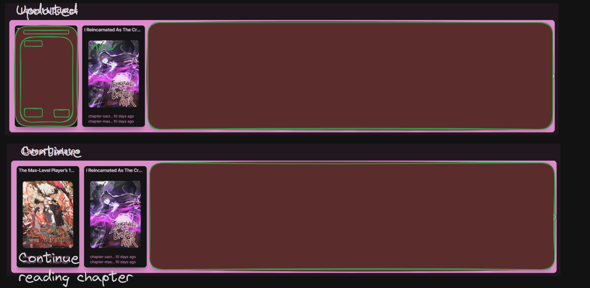
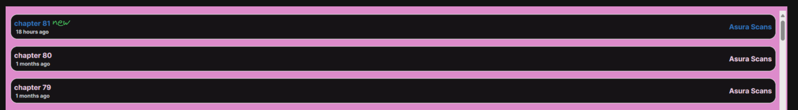

## Getting Started

## Todo
* prevent people from accesing sitemap for normal users. admin/auth
* Henri: make it one useEffect manga.tsx
* Fix the query and fix the total count kadkomi-prod\src\app\api\search\route.ts
* Remove all of headless ui and replace it

## BIG TODO

Cookies: track what the user has seen letest

User watched: when user goes onto a series add it to "followed" make a button to unfollow or follow

Series updated: compare the last chapter when the person followed to current latest and if its less than add a tag saying updated/new?

Series continue: if the person has not finished the series it will go to the continue section

series all chapter: if a user reaches the latest chapter then any chapter after that will be new until its read, if released within 24h new diffrent somehow

120
updated
100
continue

